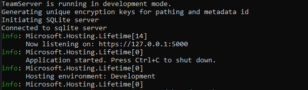

# Getting Started

## Prerequisites

Installation of the [.net 7 SDK](https://dotnet.microsoft.com/en-us/download/dotnet/7.0) from Microsoft&#x20;

Once installed, the teamserver and client are started with `dotnet run`

## Teamserver

1. To configure the team server's starting address (where clients and implants will connect back to), edit the `HardHatC2\TeamServer\Properties\LaunchSettings.json` changing the `"applicationUrl": "https://127.0.0.1:5000"` <mark style="color:blue;"></mark> to the desired location and port.&#x20;
2. start the teamserver with `dotnet run` from its top-level folder `../HrdHatC2/Teamserver/`
3.

    <figure><figcaption></figcaption></figure>

## HardHat Client&#x20;

1. When starting the client to set the target teamserver location, include it in the command line `dotnet run https:\\127.0.0.1:5000` for example&#x20;
2. open a web browser and navigate to [https://localhost:7096/](https://localhost:7096/) if this works, you should see the login page&#x20;
3. Create a new user if successful, a  message should appear, then you may log in to access the client
4. note, if you require team-lead privileges once your account is created log in with the admin account, navigate to the settings page, and click the check box next to Promote to team-lead

<figure><figcaption></figcaption></figure>
