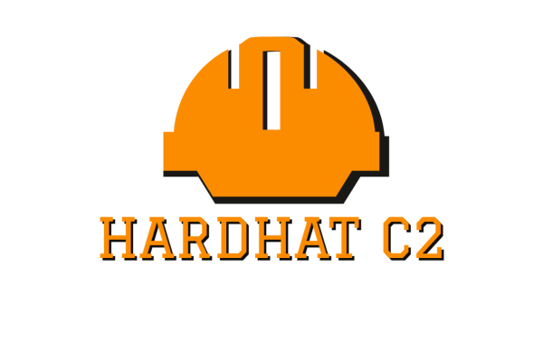

# HardHat C2

## Overview&#x20;

HardHat is a c# .NET based command and control framework. Designed to aid in red team engagements and penetration testing. HardHat aims to improve the quality of life factors during engagements by providing an easy-to-use but still robust C2 framework.    \
It contains three primary components, an ASP.NET teamserver, a blazor .NET client, and c# based implants.  &#x20;

<figure><figcaption></figcaption></figure>

## Features

HardHat contains many needed features for C2 operations.

### Teamserver & Client&#x20;

* Per-operator accounts with account tiers to allow customized access control and features, including view-only guest modes, team-lead opsec approval(WIP), and admin accounts for general operation management.&#x20;
* Managers (Listeners)&#x20;
* Dynamic Payload Generation (Exe, Dll, shellcode, PowerShell command)
* Creation & editing of C2 profiles on the fly in the client
* Customization of payload generation&#x20;
  * sleep time/jitter&#x20;
  * kill date
  * working hours&#x20;
  * type (Exe, Dll, Shellcode, ps command)
  * Included commands(WIP)
  * option to run confuser
* File upload & Downloads&#x20;
* Event Log&#x20;
* JSON logging for events & tasks&#x20;
* Loot tracking (Creds, downloads)
* IOC tracing&#x20;
* Pivot proxies (SOCKS 4a, Port forwards)
* Cred store&#x20;
* Autocomplete command history&#x20;
* Detailed help command&#x20;
* Persistent database storage of teamserver items (User accounts, Managers, Engineers, Events, tasks, creds, downloads, uploads, etc. )
* Recon Entity Tracking (track info about users/devices, random metadata as needed)
* Shared files for some commands (see teamserver page for details)

### &#x20;Engineers

* c# .net framework implant for windows devices, currently only clr/net 4 support
* atm only one implant, but looking to add others&#x20;
* It can be generated as exe, dll, shellcode, or powershell stager
* Rc4 encryption of payload memory & heap when sleeping (Exe / DLL only)
* AES encryption of all network communication&#x20;
* ConfuserEx integration for obfuscation
* HTTP, HTTPS, TCP, SMB communication
  * TCP & SMB can work P2P in bind or reverse setups
* Unique per implant key generated at compile time&#x20;
* multiple callback uri's depending on C2 profile&#x20;
* P/Invoke & D/Invoke integration for windows API calls&#x20;
* SOCKS 4a support&#x20;
* Reverse Port Forward & Port Forwards&#x20;
* All commands run as async cancellable jobs&#x20;
  * Option to run commands sync if desired
* Inline assembly execution & inline shellcode execution
* DLL Injection&#x20;
* Execute assembly & mimikatz integration
  * mimikatz is not built into the implant but is pushed when specific commands are issued
* Various localhost & network enumeration tools&#x20;
* Token manipulation commands&#x20;
  * Steal Token Mask&#x20;
* Lateral Movement Commands&#x20;
  * Jump (psexec, wmi, wmi-ps, winrm, dcom)
  * Remote Execution (WIP)
* AMSI & ETW Patching&#x20;
* Unmanaged Powershell&#x20;
  * Script Store (can load multiple scripts at once if needed)
*

